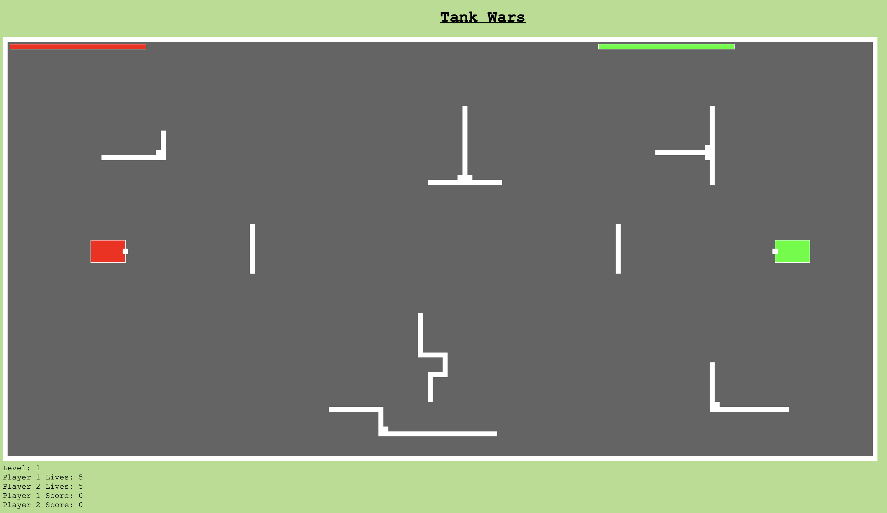
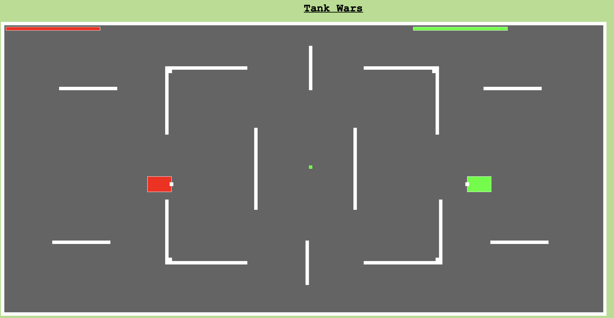
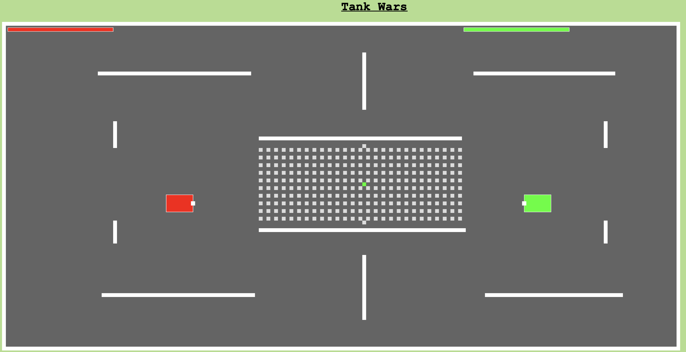

# Tank Wars

**Tank Wars** – A fast-paced, two-player browser game built with JavaScript and p5.js.  

Players battle across three maps with unique obstacles, collision mechanics, and power-ups for speed, health, and firepower. The goal is to win two out of three rounds by outmaneuvering and shooting the opponent, showcasing clean code structure and core front-end game development skills.

---

## Features
- **Two-player gameplay** with independent control schemes.
- **Three unique maps**, each with distinct wall layouts and gameplay flow.
- **Dynamic obstacles** that block movement and projectiles.
- **Power-ups** that enhance speed, health, and firepower.
- **Health and life tracking** for each player.
- **Audio integration** for background music and hit effects.
- **Clean, modular code** split into multiple JavaScript files for maintainability.

---

## Skills Demonstrated
- **JavaScript ES6** – Game logic, event handling, and state management.
- **p5.js** – Rendering, animation loops, collision detection.
- **Object-Oriented Programming** – Tank, Bullet, Wall, and Power-up classes.
- **Modular Code Organization** – Separate JS files for each major feature.
- **2D Game Physics** – Movement, collision, and projectile mechanics.
- **Asset Integration** – Images, sound effects, and background music.
- **HTML5 & CSS3** – Game UI, navigation pages, and responsive layout.
- **Version Control** – Structured file organization for easy collaboration.

---

## How to Play
- **Green Tank**: Move with `WASD`, shoot with `Q`
- **Red Tank**: Move with arrow keys, shoot with `/`
- Hit your opponent **five times** to win a round.
- Win **two out of three rounds** to win the match.
- Collect power-ups for advantages in speed, health, and firepower.

---

## Maps
1. **Map 1** – Static obstacles inside walls; no power-ups.  
   

2. **Map 2** – Similar to Map 1, but includes health power-ups.  
   

3. **Map 3** – New map design with mixed walls and power-ups.  
   
---


## Project Structure
```plaintext
assets/
  Map 1.jpg
  Map 2.jpg
  Map 3.jpg
  Unknown.png
  hit.mp3
  jmusic.mp3

css/
  style.css

js/
  bullet.js
  joystick.js
  l3wall.js
  power.js
  serial.js
  sketch.js
  tank.js
  wall.js

level/
  1.txt
  2.txt
  3.txt
```
